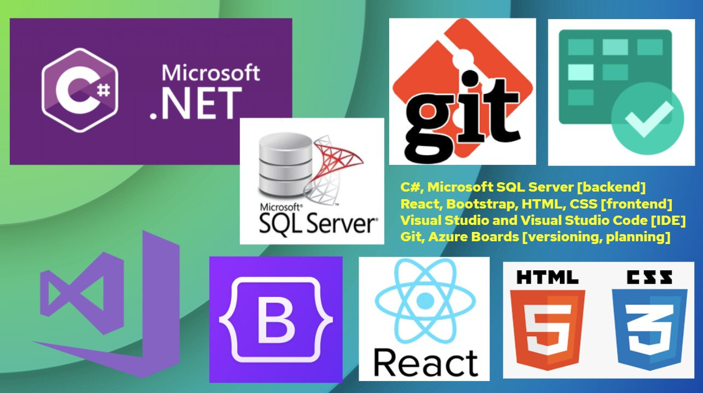
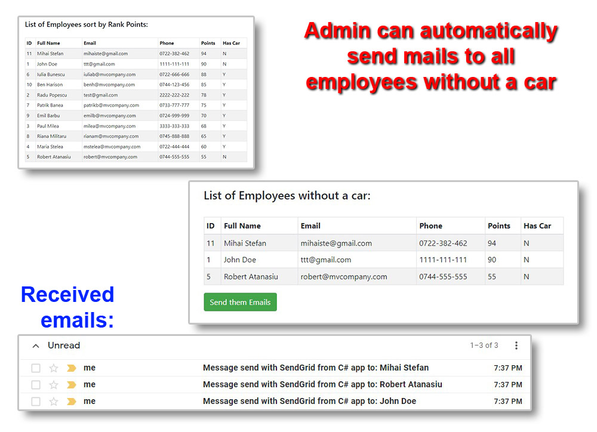
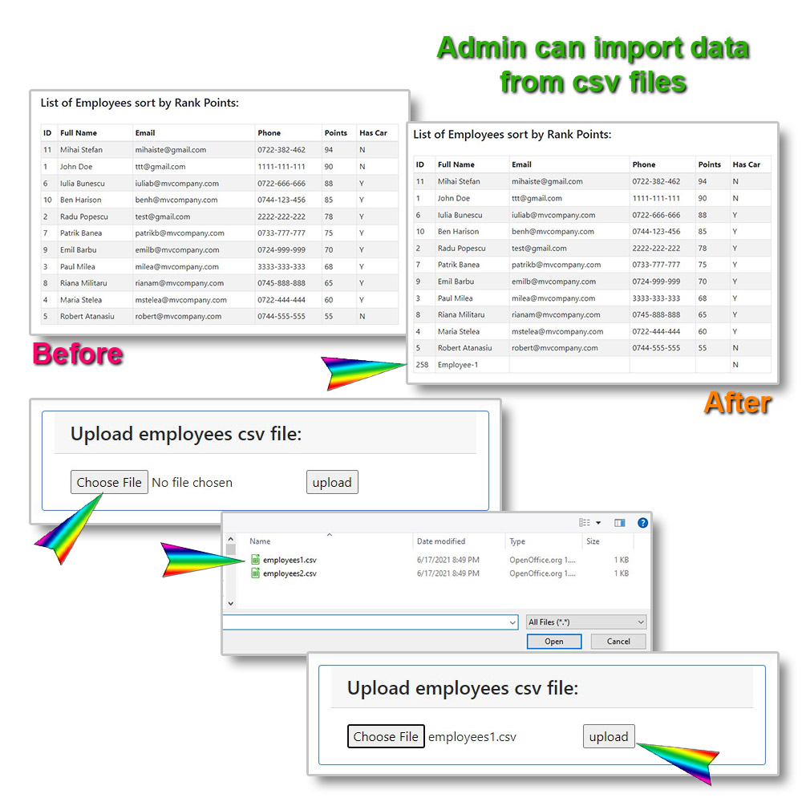
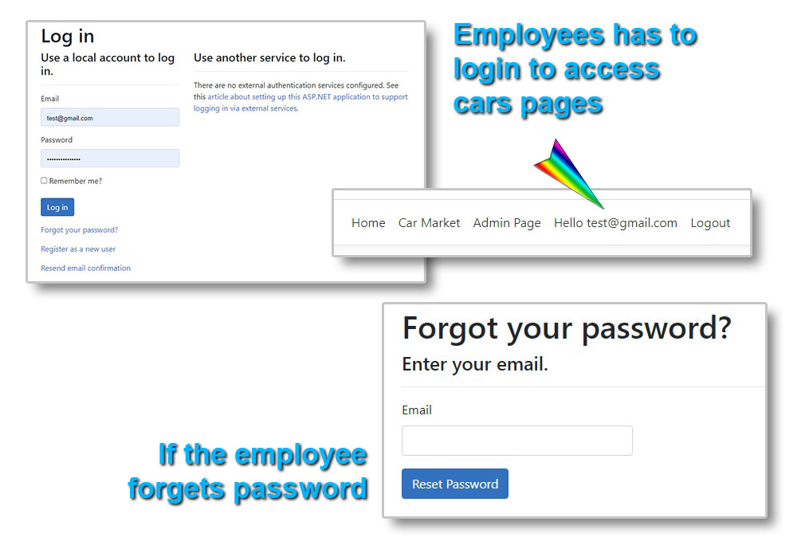
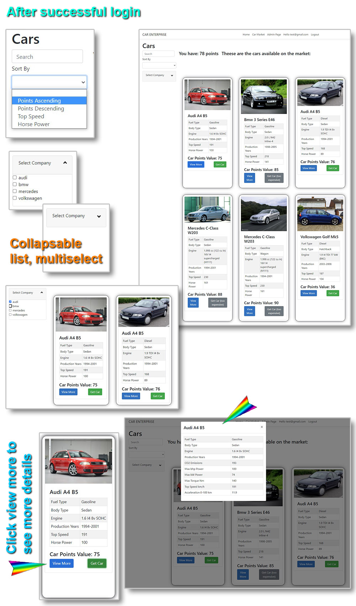
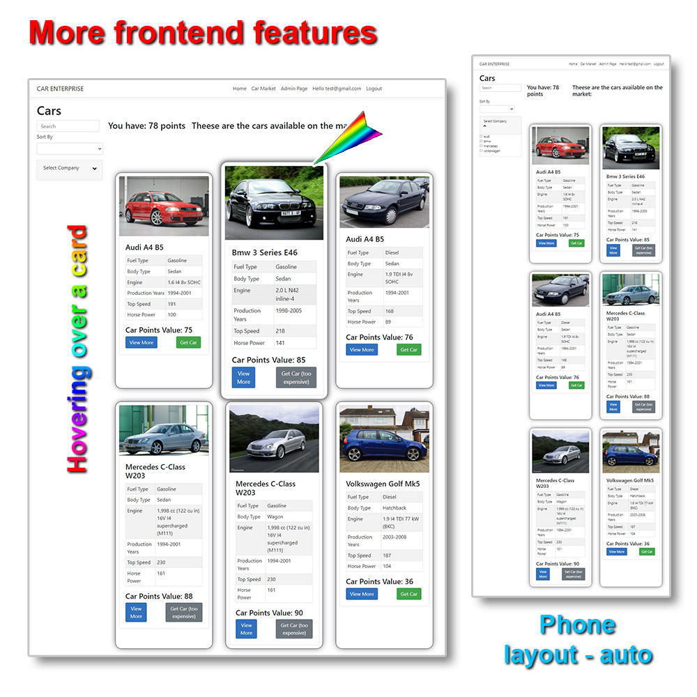

# ENTERPRISE CARS

**Team project:**  2 programmers \* (4 sprints * 4 work days + 2 work days)  >> 36 Man-Days

**Technology/Language used:**

* C#, Microsoft SQL Server [backend]
* React, Bootstrap, HTML, CSS [frontend]
* Visual Studio and Visual Studio Code [IDE]
* Git, Azure Boards [versioning, planning]

## Client [school] requirements:

* Design and implement the backend part of the project with **API design** and business logic.
* Design and implement the frontend part of the project with multiple routes and fetching from backend API using **React**.
* Both of them should go to **different GitHub repos**.

## Description:

This is the main project for **ENTERPRISE CARS** ( including React frontend app )

The API for this project is in the following repo:

An web application for companies that make cars available to some of their employees, based on an employee evaluation system
Backend: C# and Microsoft SQL, SendGrid for sending emails
Frontend: React

## ADMINISTRATOR: Usage and Features samples:

* Admin can send emails to filtered employees with one click.

* Import employees data from uploading csv file:

## EMPLOYEE: Usage and Features samples:

* Login process:

  

  

* After successful login, user can browse, sort, filter, see more details about company's cars.

* Some nice frontend features

## POSSIBLE NEXT STEPS:

* Distribution of cars to employees > in progress

* User friendly interfaces for database management

* Change registration logic - only employees can get access

* Unify the two databases used in the two projects